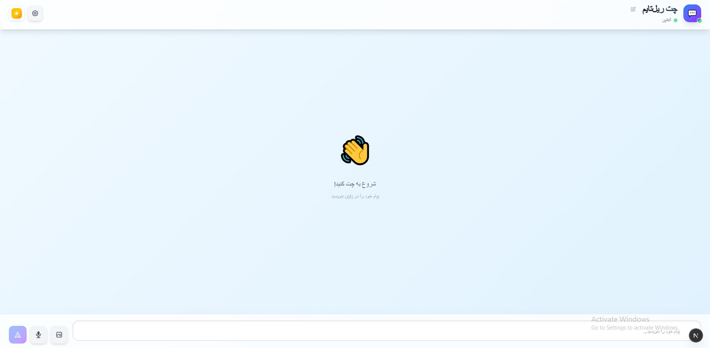
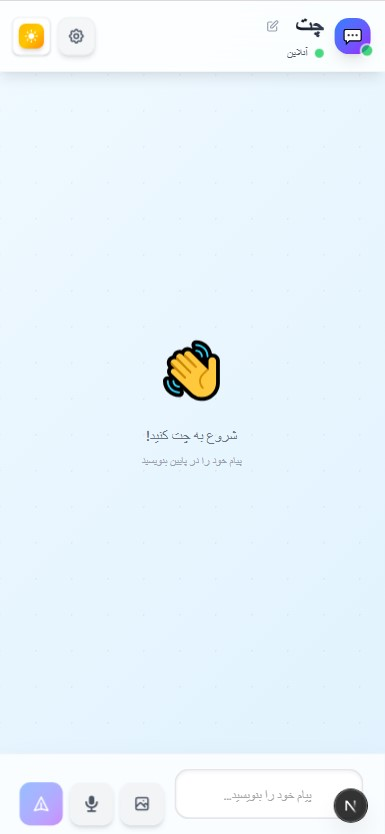
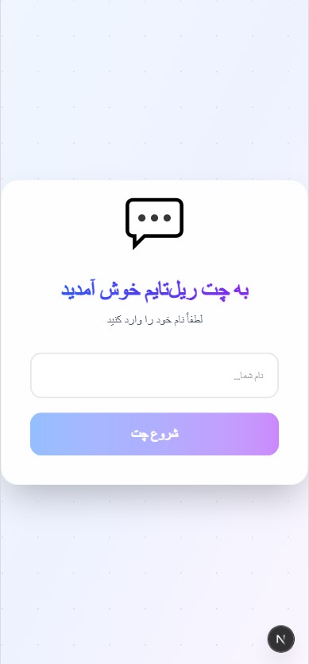

💬 Real-Time Chat App
A modern, fast, and fully responsive real-time chat application built with Next.js, React 19, TypeScript, and Socket.IO

📸 Preview
<div align="center">  </div>

<div align="center" style="display: flex; justify-content: center; gap: 20px;">
  
  
</div>


<br/><br/><br/><br/>

✨ Overview
This project is a complete and advanced real-time chat system that supports sending text, image, and audio messages.
Its user-friendly design, modern interface, smooth animations, and persistent message storage make it an excellent choice for academic projects and educational use.

⭐ Features
.Real-time WebSocket messaging (Socket.IO)
.Send text messages
.Upload and send images
.Record and send voice messages
.Persistent message storage via localStorage
.Online / offline connection status
.Typing indicator
.Multiple theme modes (Light, Dark, and additional color themes)
.Fully responsive UI (Mobile & Desktop)
.Clean, scalable, and modular code structure

📁 Project Structure
```
realtime-chat/
├── public/                  # Static images, icons, audio files (contains chat.jpg)
├── server.js                # WebSocket server (Express + Socket.IO)
├── src/
│   ├── app/                 # App routes & pages
│   ├── components/          # UI components
│   ├── hooks/               # Custom hooks
│   ├── lib/                 # Helper functions
│   └── types/               # TypeScript types
└── README.md
```

🛠️ Tech Stack
.Next.js 16
.React 19
.TypeScript
.Socket.IO
.Express.js
.Tailwind CSS
.localStorage

🚀 Getting Started
1️⃣ Clone the project
```
git clone https://github.com/yourusername/realtime-chat.git
cd realtime-chat
```

2️⃣ Install dependencies
```
npm install
```

3️⃣ Run development mode
```
npm run dev
```

This starts:

Next.js client → `http://localhost:3000`
WebSocket server → `http://localhost:3001`

🎨 UI Highlights
.Clean and modern layout
.Smooth transitions and animations
.Mobile-first responsive design
.Multiple theme modes (Light, Dark, and additional color themes)
.Persian-friendly RTL support (if enabled)

📱 How to Use
.Text message: Type and press Enter
.Send image: Click the 📷 image icon
.Voice message: Hold 🎤 record button, speak, release to send
.Typing indicator shows when others are typing
.Connection status displays online/offline

⚙️ Configuration
.Change WebSocket port in `server.js`:
```js
const PORT = process.env.PORT || 3001;
```

🐛 Troubleshooting
.Port 3001 must be free
.Microphone permissions must be allowed
.Clear `localStorage` if messages don't load
.Restart server if WebSocket connection drops

🤝 Contributing
Pull requests and issues are welcome.
For major changes, open an issue first.

######  *Designed & Developed • 2025*
